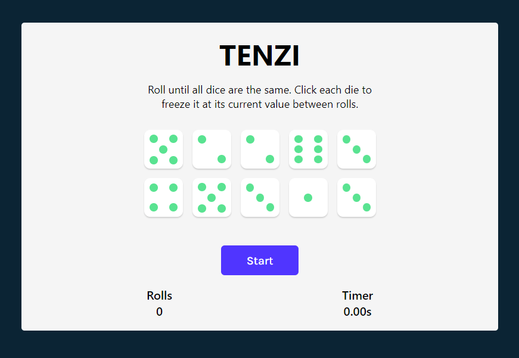
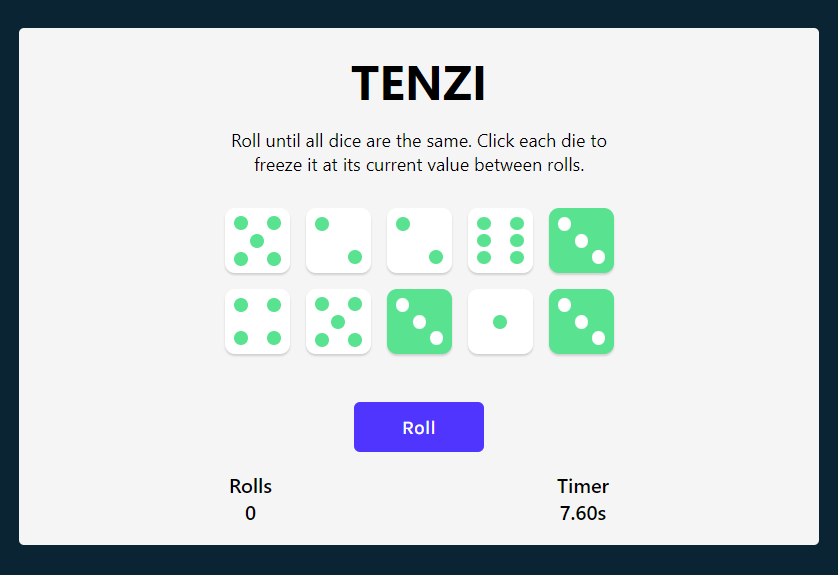
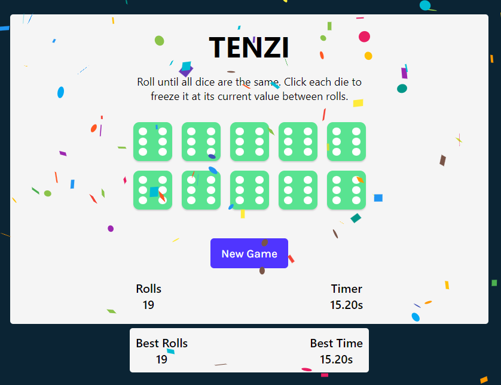

# Tenzies Game

Tenzies is a simple and responsive dice game built with React. Click to hold dice, match the winning combo, and aim for victory. Track your best rolls and time. Check it out live [here](https://tenzii-game.netlify.app/). Enjoy a straightforward gaming experience!

## Features

- Dice rolling and holding functionality.
- Customized Die component with dynamic dots based on dice value.
- Winning condition with Confetti animation: Roll all dice with the same value.
- Best rolls and time tracking.

## How to Play

1. Click each die to freeze it at its current value.
2. Roll the remaining dice to match the winning combination.
3. If all dice are held and have the same value, you win!
4. Track your best rolls and time to improve your performance.

## Deployment

The project is deployed using Netlify. You can access the live version of Tenzies [here](https://tenzii-game.netlify.app/). The deployment is automatically updated when changes are pushed to the `master` branch.

## Screenshots

## Local Storage

- **Best Rolls:** Your lowest number of rolls to achieve a tenzi.
- **Best Time:** Your fastest time to achieve a tenzi.

## Acknowledgments

This project was inspired by the Tenzies tutorial in the [Scrimba React course](https://scrimba.com/learn/learnreact), with additional features and enhancements.
